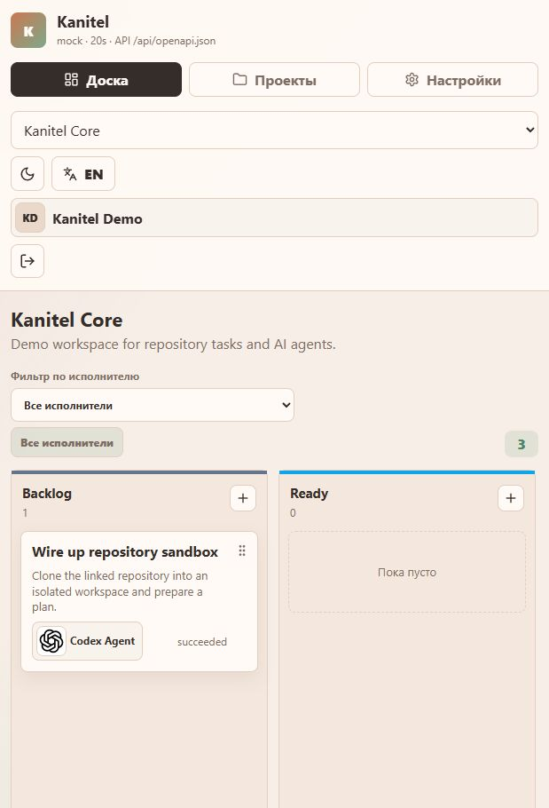
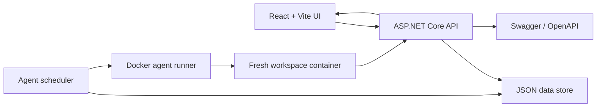

# Kanitel

[](./Dockerfile)
[](./apps/api)
[](./apps/web)
[](./apps/web)
[](./apps/web)
[](#api)
[](#agent-runtime)
[](#features)
[](./LICENSE.md)

Kanitel is a Docker-ready kanban workspace for teams that delegate repository work to AI agents.
It combines a warm React board, an ASP.NET Core API, JSON persistence, Swagger docs, and a scheduler
that runs agents in isolated Docker workspaces.



## Why Kanitel

Kanitel treats humans and agents as first-class project participants. A task can be authored by a
person or an agent, assigned to either, discussed in comments, moved across configurable columns, and
audited through history. Agents can safely report progress back through the API instead of scraping
the UI.

## Features

- Multi-project kanban boards with configurable columns and drag-and-drop task movement.
- Local registration, login, profile settings, password changes, and avatar upload.
- Unified participants: assign tasks to people or AI agents from the same field.
- Global agent catalog: configure agents once, then add them to projects as participants.
- Linked repositories over HTTP(S) or SSH.
- Task modal with auto-save, newest-first comments, and change history.
- Light/dark themes and Russian/English localization.
- Swagger UI plus a compact discovery endpoint for external AI managers.
- Single-container deployment: frontend, API, scheduler, Docker runner, and persistence together.

## Quick Start

Requirements:

- Docker Desktop or Docker Engine
- Git

```powershell
git clone <your-fork-or-repo-url> Kanitel
cd Kanitel
copy .env.example .env
docker compose up --build
```

Open:

- App: [http://localhost:8080](http://localhost:8080)
- Swagger: [http://localhost:8080/swagger](http://localhost:8080/swagger)
- Lightweight API index: [http://localhost:8080/api/openapi.json](http://localhost:8080/api/openapi.json)

The first registered user is automatically added to the seed project.

## Docker

Kanitel is designed to ship as one container:

```powershell
docker compose up --build
```

The compose file mounts Docker's socket so Kanitel can start fresh work containers for agents:

```yaml
volumes:
  - kanitel-data:/data
  - /var/run/docker.sock:/var/run/docker.sock
```

Treat Docker socket access as highly privileged. Keep it only when you want real agent execution.
For UI/API development without containerized agent runs, use:

```dotenv
KANITEL_AGENT_RUNNER=mock
```

## Configuration

Core runtime variables:

```dotenv
KANITEL_AGENT_RUNNER=docker
KANITEL_AGENT_POLL_INTERVAL_SECONDS=20
KANITEL_AGENT_TIMEOUT_MINUTES=30
KANITEL_PUBLIC_API_URL=http://host.docker.internal:8080
KANITEL_DOCKER_ADD_HOST_GATEWAY=true
```

Initial agents can be declared in indexed env blocks. Empty blocks are ignored.

```dotenv
AGENT_0_NAME=Codex
AGENT_0_PROVIDER=codex
AGENT_0_API_URL=https://chatgpt.com/backend-api/codex
AGENT_0_API_KEY=
AGENT_0_MODEL=codexplan
AGENT_0_TEMPLATE=general-purpose
AGENT_0_AVATAR_URL=https://www.google.com/s2/favicons?sz=128&domain=chatgpt.com
AGENT_0_ENABLED=true

AGENT_1_NAME=Claude
AGENT_1_PROVIDER=anthropic
AGENT_1_API_URL=https://api.anthropic.com
AGENT_1_API_KEY=
AGENT_1_MODEL=claude-sonnet-4-6
AGENT_1_TEMPLATE=general-purpose
AGENT_1_ENABLED=true
```

Use `AGENT_2_*`, `AGENT_3_*`, and so on for more agents. Env agents are imported only when
Kanitel creates a new data file; after that, manage agents in the UI.

`AGENT_N_API_KEY` is forwarded from the Kanitel host process into the agent container under the
provider's expected key name. Set `AGENT_N_API_KEY_ENV` only when you need to override that target
variable.

For the GitHub Copilot preset, OpenClaude requires a non-interactive `GITHUB_TOKEN`/`GH_TOKEN`
credential. Kanitel cannot run `/onboard-github` inside a disposable task container. A regular
GitHub PAT works with GitHub Models endpoints, but not with `https://api.githubcopilot.com`.

## Agent Runtime

Kanitel scans the board on an interval and starts an agent only when:

1. The task is assigned to an enabled project agent.
2. The latest task comment is not authored by that same agent.
3. The latest task comment is not a system error/status message.

When an agent runs, Kanitel creates an isolated workspace container and passes context through
environment variables:

```dotenv
KANITEL_DOCKER_WORKSPACE_MODE=copy
KANITEL_API_URL=http://host.docker.internal:8080
KANITEL_PROJECT_ID=project_...
KANITEL_TASK_ID=task_...
KANITEL_AGENT_ID=agent_...
KANITEL_TASK_PROMPT_FILE=/workspace/task.md
```

`KANITEL_DOCKER_WORKSPACE_MODE=copy` is the default because it works when Kanitel itself runs in a
Docker container: Kanitel copies the prepared workspace into the agent container with `docker cp`,
then copies the result back. Use `bind` only when the workspace path is visible to the Docker daemon
on the host.

Agents can report back with simple HTTP callbacks:

```bash
curl -s -X POST "$KANITEL_API_URL/api/agent/tasks/$KANITEL_TASK_ID/comments" \
  -H "Content-Type: application/json" \
  -d "{\"agentId\":\"$KANITEL_AGENT_ID\",\"body\":\"I inspected the repository and found the entry point.\"}"

curl -s -X PATCH "$KANITEL_API_URL/api/agent/tasks/$KANITEL_TASK_ID" \
  -H "Content-Type: application/json" \
  -d "{\"agentId\":\"$KANITEL_AGENT_ID\",\"columnName\":\"Review\",\"body\":\"Moved to review.\"}"
```

Agents can comment, move status by column name/id, change title/description, assign another linked
agent, or clear their own assignment with `unassignAgent=true`.

## API

Kanitel exposes two API discovery surfaces:

- Full Swagger UI: `/swagger`
- Compact manager-friendly index: `/api/openapi.json`

Useful endpoints:

| Method | Path | Purpose |
| --- | --- | --- |
| `POST` | `/api/auth/register` | Create a local user account |
| `POST` | `/api/auth/login` | Login and receive a bearer token |
| `GET` | `/api/bootstrap` | Load board state, providers, templates, and scheduler info |
| `POST` | `/api/projects` | Create a project with default columns |
| `POST` | `/api/projects/{projectId}/tasks` | Create a task |
| `PATCH` | `/api/tasks/{taskId}` | Auto-save task details, assignment, status, or position |
| `POST` | `/api/tasks/{taskId}/comments` | Add a human/system comment |
| `POST` | `/api/agent/tasks/{taskId}/comments` | Add a comment as a linked agent |
| `PATCH` | `/api/agent/tasks/{taskId}` | Agent action endpoint |
| `POST` | `/api/uploads/avatar` | Upload an avatar image and receive a data URL |

Authentication uses bearer tokens:

```http
Authorization: Bearer <token>
```

## Local Development

Requirements:

- .NET SDK 9
- Node.js 22+
- npm

Run the API:

```powershell
$env:KANITEL_AGENT_RUNNER="mock"
dotnet run --project apps/api/Kanitel.Api.csproj --urls http://127.0.0.1:8080
```

Run the web app:

```powershell
cd apps/web
npm install
npm run dev -- --host 127.0.0.1 --port 5173
```

The Vite dev server proxies `/api` to `http://127.0.0.1:8080`.

Build checks:

```powershell
dotnet build apps/api/Kanitel.Api.csproj
cd apps/web
npm run build
```

## Architecture



## Repository Layout

```text
.
|-- apps
|   |-- api        ASP.NET Core API, scheduler, Docker runner, Swagger, static host
|   `-- web        React + Vite UI
|-- docs
|   `-- assets     README and documentation media
|-- Dockerfile
|-- docker-compose.yml
|-- .env.example
`-- LICENSE.md
```

## Data And Persistence

By default the container stores state at:

```dotenv
KANITEL_DATA_PATH=/data/kanitel.json
KANITEL_WORKSPACES_PATH=/data/workspaces
```

The compose file persists `/data` in the `kanitel-data` volume.

## License

Kanitel currently uses a custom restricted copyleft license. See [LICENSE.md](./LICENSE.md).
The license text explicitly notes that it is not OSI-approved; review it before publishing,
redistributing, or using Kanitel in production.
